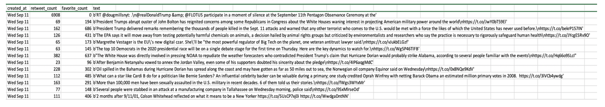

# Data description
## 1.Size and variables
My dataset is scraped from Twitter and will contain about 2500 entries. I am scraping the daily tweets by New York Times from September 10 to October 10, as New York Times posts about 80 tweets every day, this will give me about 2500 tweets and their relevant index.
My variables are several features of a tweet: text, count of retweets, count of likes.
There will not be missing data, the only exception is that maybe the Twitter API may be unstable occasionally, but this has not been a problem yet till now.
## 2.Source
The URL of raw data is the twitter page of New York Times: https://twitter.com/nytimes, and the process of scraping uses the “GET statuses/user_timeline” application of Twitter API, the reference for the usage is: https://developer.twitter.com/en/docs/tweets/timelines/api-reference/get-statuses-user_timeline
## 3. Sampling methods
The data is collected by simple random sampling. The 30 days of tweets are randomly picked from all the tweets by New York Times.
## 4. How to get access to it
The data can be accessed by Twitter API’s “GET statuses/user_timeline” application which can return a collection of the most recent Tweets posted by the user indicated by the screen_name or user_id parameters. I can get the most recent tweets of New York Times by specifying “screen_name = "nytimes"” and Twitter allows me to scrape the information of most recent 200 tweets every day. I can then append all the data frames together to get my final dataset for analysis.
## 5. Why it is an appropriate dataset for my research
My research is going to find out what makes New York Times’s tweets popular, my dataset can provide “count of retweets” and “count of likes” which can be used to measure the popularity of tweets, at the same time it gives me the full text of every tweet, so I can dive into the text to calculate the sentiment score, simplicity score, and also word counts and term frequency, so it is very relevant to my research question.
The data is first-hand data directly scraped from the twitter of New York Times, so it is reliable; the tweets are mostly recent news, so it is timely; “count of retweets” and “count of likes” are standard numbers, so it is accurate (the texts will be preprocessed in the future).
## 6. Data showcase
